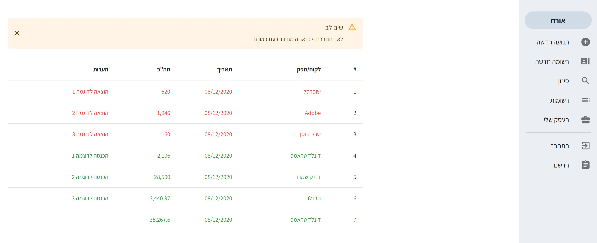
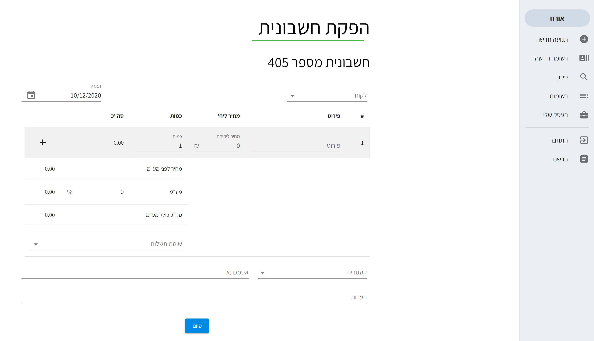
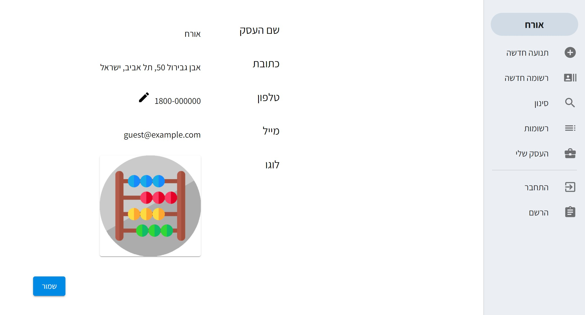
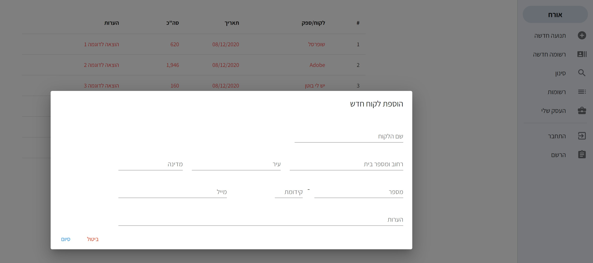

# Abaco // Accounting App

Abaco is a simple app for small businesses to run thair incomes, outcomes, suppliers and customers to become more organized and efficient..
The app developed using React and Next.js with React Hooks, JSS, Webpack, Auth0, MySQL and FTP server.
<br><br>

# Main Features

**Abaco accounting app's main features and uses:**

⏭️ [Next.js](https://nextjs.org/docs) React Framework

📥 REST API

🔎 MySQL Database 

🔒 User Authentication and Authorization ([Auth0](https://auth0.com/)) 

📁 FTP Server File Upload and Fetch 

📱 Responsiveness

🌐 HTTP Requests ([Axios](https://www.npmjs.com/package/axios))

🐟 React Hooks

🖱️ Drag n' Drop 

📄 HTML to PDF

📧 Sending Emails
<br><br>

# Screenshots:
 
 
 
 
 <br><br>

# Installation

This project was bootstrapped with [Next.js](https://nextjs.org/).
- You will need a [Node.js](https://nodejs.org/en/download/) installed in your environement.

## Clone
Clone this repo to your local machine using git clone ```https://github.com/Anael-dev/messenger-app.git```

### Setup

Install the project dependencies and packages

```bash
$ npm install
```

Run the app in a development mode

```bash
$ npm run dev
```

Navigate to ```http://localhost:3000/```
<br><br>

### Enjoy Abaco!
